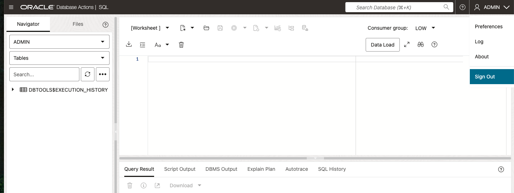

# Generate Data for Graph

## Introduction

This lab walks you through the steps to generate data for a property graph. First you will grant the graph user necessary privileges for the workshop. Next you will load the sample data, ONNX Embedding Models into the database and use the models to vectorize the text into chunks. Also, you will create PL/SQL stored procedures and functions to generate SQL from text using LLM. Finally you will a create DBMS Scheduler job to generate the SQL for each text chunk using a few shot prompt.

Estimated Time: 60 minutes
 

### Objectives

 

In this lab, you will:
* Grant user created in previous lab necessary privileges to finish workshop
* Load textual data into database
* Vectorize the textual data into chunks
* Create PL/SQL procedures/functions to generate SQL from chunks
* Create DBMS Scheduler Job to Generate SQL for each chunk

### Prerequisites (Optional)


This lab assumes you have:
* An Oracle Cloud account
* All previous labs successfully completed


 
## Task 1: Load sample data and ONNX Models for Graph user


1. Open the service detail page for your Autonomous Database instance in the OCI console.  

   Then click on **Database Actions** and select **SQL**. 

   

2. Make sure to be logged in as Admin and execute the seven SQL statements below to grant the necessary roles for the user created in Lab 1 and be sure the correct user name is referenced similar to screenshot.
 
    Paste the PL/SQL:

    ```text
        <copy>
  
            GRANT EXECUTE ON DBMS_CLOUD TO <USERNAME HERE>;
            GRANT EXECUTE ON DBMS_CLOUD_PIPELINE TO <USERNAME HERE>;
            GRANT EXECUTE ON DBMS_CLOUD_AI TO <USERNAME HERE>;
        </copy>
    ```

   

3. Sign out of SQL Developer and sign back into SQL Developer as the graph user (user created in Lab 1)

    

    

4. Execute the SQL below to create a directory, download an onnx embedding model, load in the schema and download text sample data.
  
    Paste the PL/SQL:
    
      ```text
      <copy>
            /**Create directory to hold onnx model and text later on**/
            CREATE OR REPLACE DIRECTORY GRAPHDIR as 'scratch/';

            BEGIN
            /** download onnx model from object storage bucket**/    
            DBMS_CLOUD.GET_OBJECT(
            object_uri => 'https://objectstorage.us-chicago-1.oraclecloud.com/n/idb6enfdcxbl/b/Livelabs/o/onnx-embedding-models/tinybert.onnx',
            directory_name => 'GRAPHDIR');

            /** load onnx model into schema**/    
            DBMS_VECTOR.LOAD_ONNX_MODEL(
                'GRAPHDIR',
                'tinybert.onnx',
                'TINYBERT_MODEL',
                json('{"function":"embedding","embeddingOutput":"embedding","input":{"input":["DATA"]}}')
              );

            /** load sample data **/
            DBMS_CLOUD.GET_OBJECT(
            object_uri => 'https://objectstorage.us-chicago-1.oraclecloud.com/n/idb6enfdcxbl/b/Livelabs/o/sample-data/blue.txt',
            directory_name => 'GRAPHDIR');
     
            END;
            /
    </copy>
    ```

  

5. Create cloud credentials and an AI Profile for Graph User. Type the following sql code in the worksheet area and update with API Key configurations in four places. Update for user_ocid, tenancy_ocid, private_key, and fingerprint. Each value can be found in Lab 1, Task 2, Steps 3/4. Click the run script button and check the script output to make sure it completed successfully.
        

    Paste the PL/SQL:

    ```text
        <copy>
                  BEGIN                                                                         
                  DBMS_CLOUD.CREATE_CREDENTIAL(                                               
                      credential_name => 'GENAI_GRAPH_CRED',                                          
                      user_ocid       => '<UPDATE HERE>',
                      tenancy_ocid    => '<UPDATE HERE>',
                      private_key     => '<UPDATE HERE>',
                      fingerprint     => '<UPDATE HERE>'
                      );
                  END;
        </copy>
    ```

    
 


## Acknowledgements


* **Author**
    * **Jadd Jennings**, Principal Cloud Architect, NACIE

* **Contributors**


* **Last Updated By/Date**
    * **Jadd Jennings**, Principal Cloud Architect, NACIE, June 2025