# Generate Data for Graph

## Introduction


Estimated Time: 60 minutes
 

### Objectives

 

In this lab, you will:

*  

### Prerequisites (Optional)


This lab assumes you have:
* An Oracle Cloud account
* All previous labs successfully completed


 
## Task 1:


1. Open the service detail page for your Autonomous Database instance in the OCI console.  

   Then click on **Database Actions** and select **SQL**. 

   

2. Make sure to be logged in as Admin and execute the seven SQL statements below to grant the necessary roles for the schema created in Lab 1 and be sure the correct schema is referenced similar to screenshot.
 
    Paste the PL/SQL:

    ```text
        <copy>
            GRANT EXECUTE ON DBMS_LOCK TO <SCHEMA NAME HERE>;

            GRANT EXECUTE ON DBMS_CLOUD_AI TO  <SCHEMA NAME HERE>;

            GRANT EXECUTE ON DBMS_CLOUD_PIPELINE TO  <SCHEMA NAME HERE>;

            GRANT EXECUTE ON DBMS_CLOUD TO  <SCHEMA NAME HERE>; 

        </copy>
    ```

   

3. Sign out of SQL Developer 

 
## Task 2:

In this task we deploy a sample Apex app into the workspace

1. Download the prebuilt Apex chatbot application

    a. [apex_chatbot_workflows.sql](https://objectstorage.us-chicago-1.oraclecloud.com/n/idb6enfdcxbl/b/Livelabs/o/apex-chatbot-multi-tool-livelab%2Fapex_chatbot_workflows.sql)


2. Login into the workspace using the name and credentials you created in Lab 1

    


3. open the sample datasets utility

    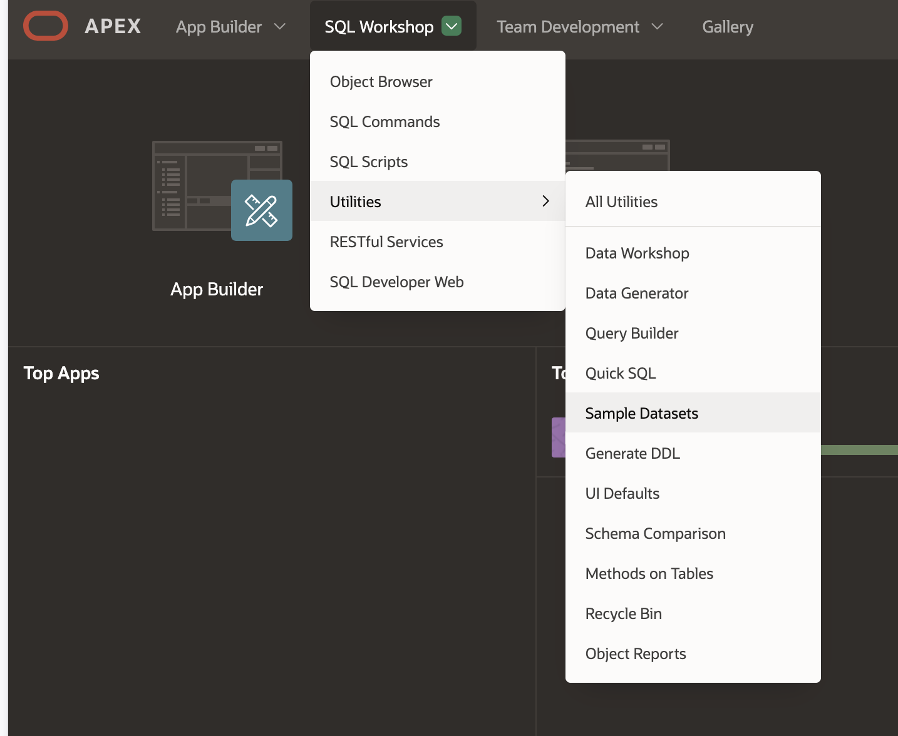


4. Find the Countries row, click the install button and than click the install dataset button
    
    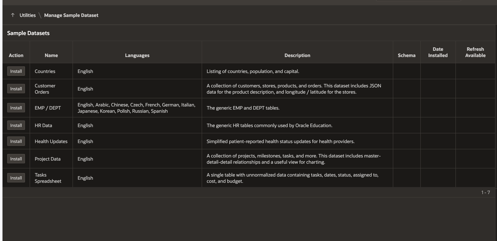
    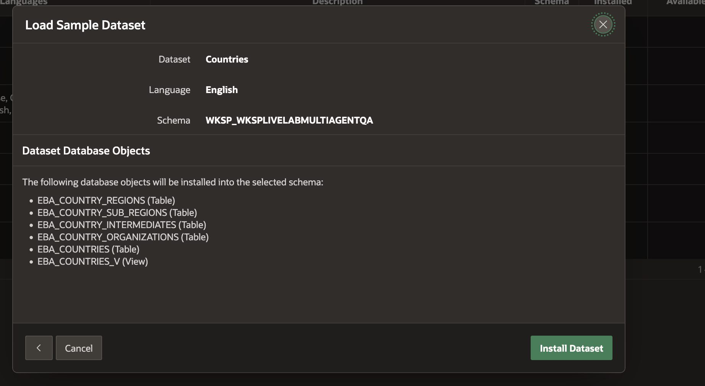

5. After the sample dataset installs, the Countries install button should now be an Update button
    
    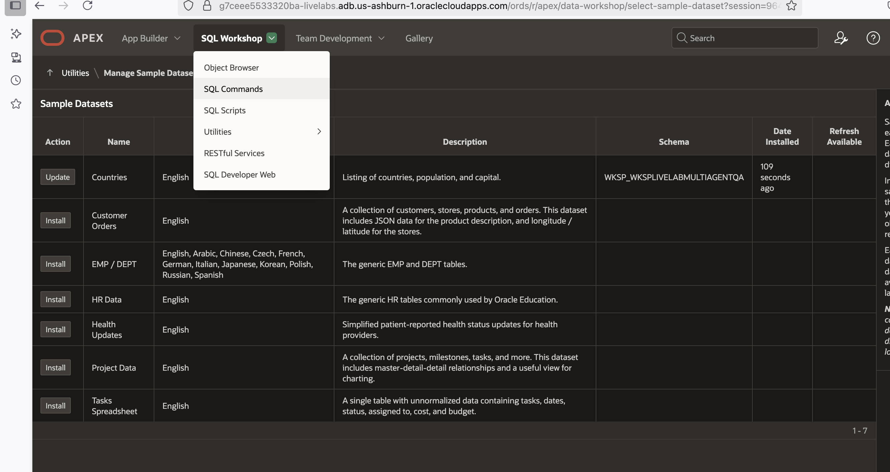

## Task 3

1. From the workspace home screen click the App Builder button.

    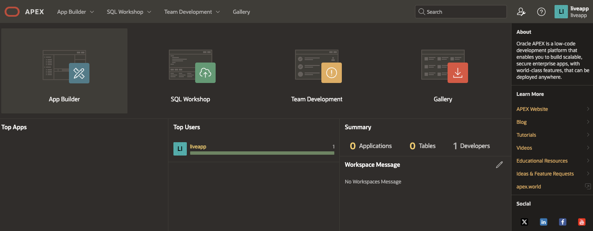

3. Click the import button.

    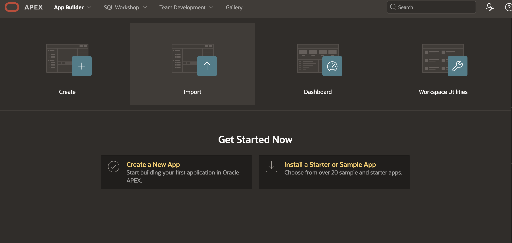

4. Import the prebuilt apex app from task 1.

    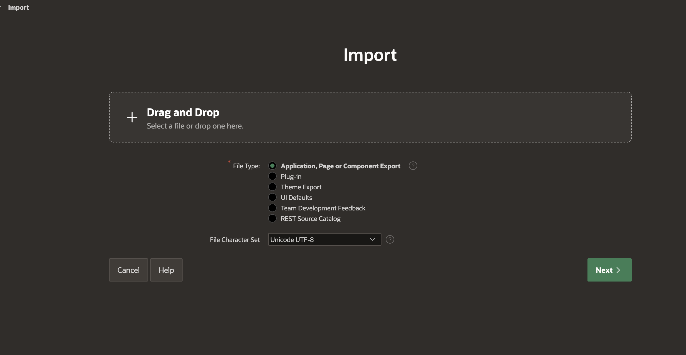
    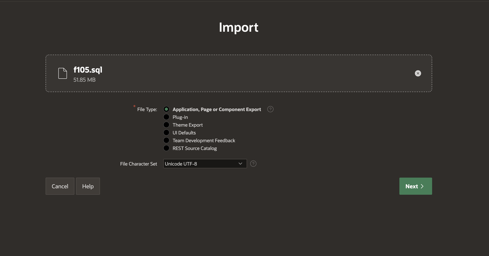

5. Click the next button.

  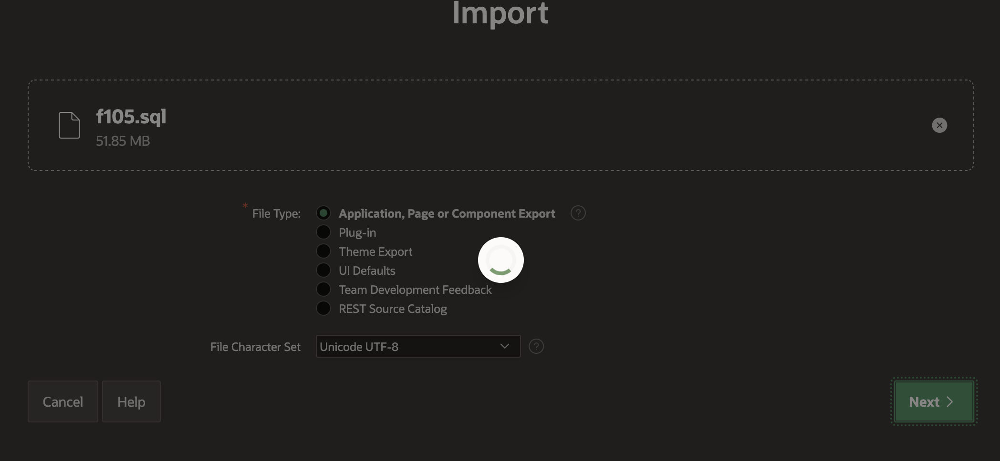
 
6. Click install supporting objects button.

  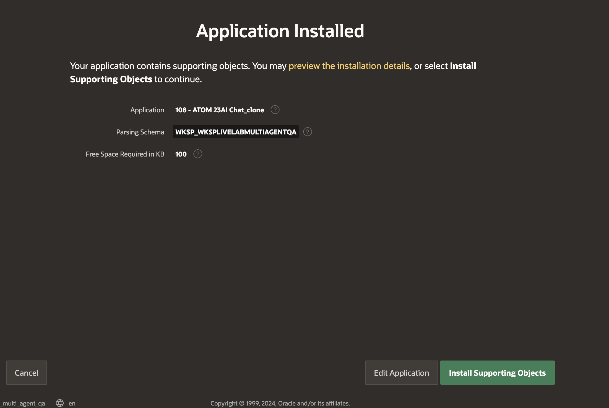
  


## Task 4:


1. Open SQL Commands, from SQL Workshop drop down


  

2. Copy SQL below to load tool table

    Paste the PL/SQL:

    ```text
        <copy>
        INSERT INTO ADB_CHAT_TOOL (ID, TOOL_NAME, TOOL_DESCRIPTION)
            SELECT 1, 'OCI Object Storage','Vectorized PDF Files of ERP Cloud Country Data Sheets. Holds information about ERP Cloud features for different countries.'
        UNION SELECT 2, 'Database','database of countries with a column for Proprietary Information. This is the preferred tool for most prompts'
        UNION SELECT 3, 'Large Language Model','Large Language Model LLM'
        UNION SELECT 4, 'Meteo Weather API','Weather API that will return weather in JSON format for given location'

        </copy>
    ```
  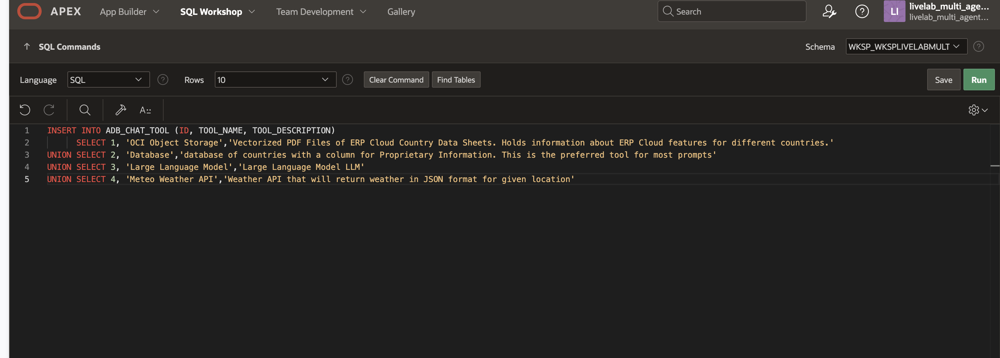

3. Copy SQL below to create OCI Credentials, use credentials created in Lab 1, Task 1

    Paste the PL/SQL:

    ```text
        <copy>
            BEGIN                                                                         
            DBMS_CLOUD.CREATE_CREDENTIAL(                                               
                credential_name => 'APEX_GENAI_CRED',                                          
                user_ocid       => '<UPDATE HERE>',
                tenancy_ocid    => '<UPDATE HERE>',
                private_key     => '<UPDATE HERE>',
                fingerprint     => '<UPDATE HERE>'
            );
            END;
        </copy>
    ```
  

  3. Copy SQL below to create OCI Credentials, use credentials created in Lab 1, Task 1

    Paste the PL/SQL:

    ```text
        <copy>
            BEGIN                                                                         
            DBMS_CLOUD.CREATE_CREDENTIAL(                                               
                credential_name => 'APEX_GENAI_CRED',                                          
                user_ocid       => '<UPDATE HERE>',
                tenancy_ocid    => '<UPDATE HERE>',
                private_key     => '<UPDATE HERE>',
                fingerprint     => '<UPDATE HERE>'
            );
            END;
        </copy>
    ```
  

4. Copy the SQL below to add the PROPRIETARY column to the EBA_COUNTRIES TABLE

    Paste the PL/SQL:

    ```text
        <copy>
        alter table "WKSP_LIVELABMULTIAGENT"."EBA_COUNTRIES" add
        ("PROPRIETARY" VARCHAR2(1000));
        </copy>
    ```

    

5. Copy the SQL below to add comments on PROPRIETARY column

    Paste the PL/SQL:

    ```text
        <copy>
        comment on column "WKSP_LIVELABMULTIAGENT"."EBA_COUNTRIES"."PROPRIETARY"
        is 'This columns is private info we have on the country it is proprietary information.';
        </copy>
    ```

     

6. Copy the SQL below to update values for specific rows in the EBA_COUNTRIES table

    Paste the PL/SQL:

    ```text
        <copy>
            BEGIN

            UPDATE EBA_COUNTRIES
            SET PROPRIETARY = 'A treasure is buried here'
            WHERE NAME = 'Iceland';

            UPDATE EBA_COUNTRIES
            SET PROPRIETARY = 'a map for the treasure is hidden here'
            WHERE NAME = 'Peru';

            END;
        </copy>
    ```

     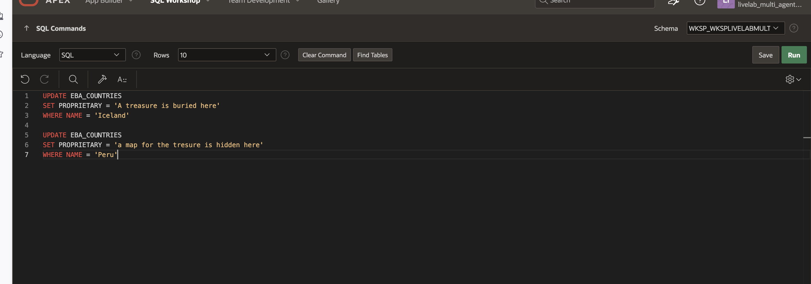

7.  Create profile for LLM, RAG, NL2SQL and Vector Index

    Paste the PL/SQL:

    ```text
        <copy>
        BEGIN        
                                                                 
        DBMS_CLOUD_AI.CREATE_PROFILE(                                              
        profile_name =>'GENAI',                                                             
        attributes   =>'{
                        "provider": "oci",                                                                   
                        "credential_name": "APEX_GENAI_CRED",
                        "conversation": "true"
                        }');                                                                  
                                                                    
        DBMS_CLOUD_AI.CREATE_PROFILE(                                              
        profile_name =>'GENAI_SQL_APEX',                                                             
        attributes   =>'{
                        "provider": "oci",                                                                   
                        "credential_name": "APEX_GENAI_CRED",
                        "object_list": [{"owner": "WKSP_LIVELABMULTIAGENT", "name": "EBA_COUNTRIES"}],
                        "conversation": "true",
                        "enforce_object_list": "true",
                        "comments": "true"
                        }');                                                                  
                                                                 
        DBMS_CLOUD_AI.CREATE_PROFILE(                                              
        profile_name =>'GENAI_VECTOR_APEX',                                                             
        attributes   =>'{
                        "provider": "oci",                                                                   
                        "credential_name": "APEX_GENAI_CRED",
                        "vector_index_name": "ERP_FEATURES_COUNTRY3"
                        }');                                                                  

        DBMS_CLOUD_AI.CREATE_VECTOR_INDEX(
            index_name  => 'ERP_FEATURES_COUNTRY3',
            attributes  => '{"vector_db_provider": "oracle",
                            "location": "https://objectstorage.us-chicago-1.oraclecloud.com/n/idb6enfdcxbl/b/Livelabs/o/apex-chatbot-multi-tool-livelab/",
                            "profile_name": "GENAI_VECTOR_APEX",
                            "vector_table_name":"ERP_FEATURES_COUNTRY_VECTOR",
                            "vector_distance_metric": "cosine"
                        }'
            );     
        END;
        </copy>
    ```

     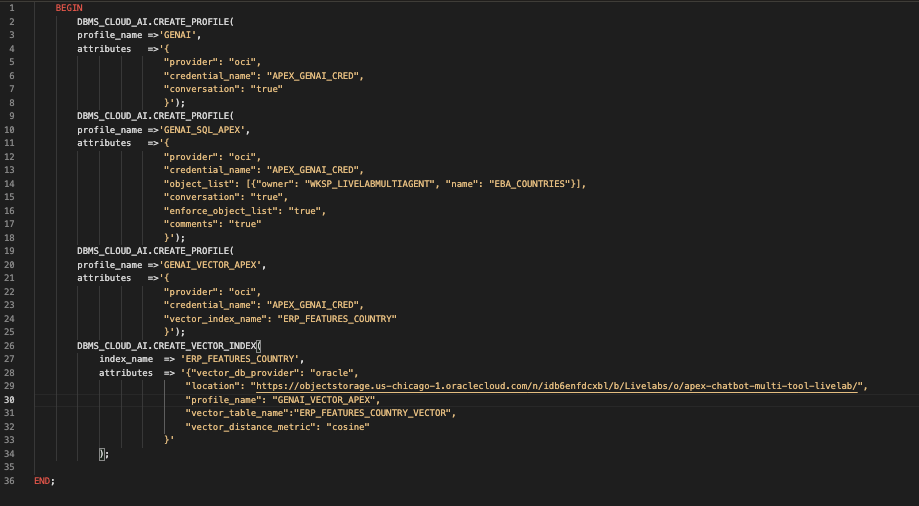

## Acknowledgements


* **Author**
    * **Jadd Jennings**, Principal Cloud Architect, NACIE

* **Contributors**


* **Last Updated By/Date**
    * **Jadd Jennings**, Principal Cloud Architect, NACIE, June 2025